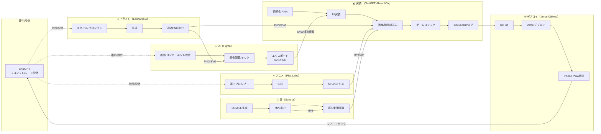

# 🍶 環状線飲みアプリ（仮称）仕様書【v1.0 完全版】

---

## 1. 🎯 アプリ概要

**環状線飲みアプリ**は、大阪環状線の各駅を巡りながら飲み会を進行する**エンタメ系Webアプリ**。  
「次に降りる駅」「飲む杯数」「イベント」などをゲーム要素として決定し、飲み会を盛り上げます。

- **想定利用**：友人同士で1台のスマホを回しながらプレイ（私的・非公開）  
- **配布形態**：PWA（Safariからホーム画面に追加）  
- **動作**：オンラインPWA（キャッシュ対応）  
- **端末**：iPhone15（iOS17.2.1想定）  

---

## 2. 🧩 コア構成・主要要素

| 要素 | 内容 |
| --- | --- |
| **代表プレイヤー** | 各ターンの進行役。毎ターン自動交代（時計回り）。 |
| **杯数 (Drink Count)** | 各ターンで決定される飲酒杯数（最終0〜5杯）。 |
| **駅イベント** | 到着駅の属性によるイベント。全体効果 or 代表特効。 |
| **カード** | 各プレイヤーが保持・使用。攻撃・防御・特殊の3系統。 |
| **スキル** | プレイヤーレベルに応じて解放。カードより強力。 |
| **飲みスタイル** | 攻め／節度／トリックスター（カード出現率に影響）。 |
| **下限杯数 (Lᵢ)** | プレイヤーごとの最低杯数。**初期値1、可変**。 |
| **駅重複設定** | 「あり／なし」を選択。なしの場合は未訪問駅のみ選出。 |
| **成長システム** | 累積杯数でLv2〜Lv5へ。スキル解放・称号付与。 |
| **ミニゲーム** | ランダム発生の短時間イベント。杯数やXPに影響。 |

---

## 3. 🔄 ターン進行フェーズ

| フェーズ | 内容 |
| --- | --- |
| ① **運命ルーレット** | ターン全体の雰囲気（ムード・補正）を決定。 |
| ② **駅決定** | サイコロ／ルーレットで駅数を決定（駅重複設定反映）。 |
| ③ **駅イベント発動** | 属性イベント or ミニゲーム発生。代表特効あり。 |
| ④ **カードドロー** | 各プレイヤーがカードを1枚補充（上限2〜3枚、超過時は1枚捨て）。 |
| ⑤ **杯数抽選** | 飲みスタイル＋環境＋補正を反映し最終杯数を決定（0〜5、下限Lᵢ適用）。 |
| ⑥ **カード＆スキル使用** | 1台を手渡し、各自1枚 or 1スキル使用（テンポ重視）。 |
| ⑦ **成長判定** | 累積杯数→XP加算。Lv到達でスキル解放・称号。 |
| ⑧ **結果まとめ** | 杯数結果／XP／ログを一覧表示。 |

---

## 4. 🎡 運命ルーレット（Ver.2.1）

ターン全体のムードを決める6区画のシンプルなルーレット。**出現確率は各約16.7%**。

| アイコン | 名称 | 効果内容 | 演出 |
| --- | --- | --- | --- |
| 🌞 | **テンションMAX** | 全員＋1杯 | 乾杯SE・明るい背景 |
| 🌙 | **まったりモード** | 全員−1杯（下限1） | 穏やかなBGM |
| 🔥 | **攻めの気配** | 攻撃系カード出現率＋15%（次ターン） | 赤系演出 |
| 💧 | **守りの風** | 防御系カード出現率＋15%（次ターン） | 青系演出 |
| 💫 | **幸運の兆し** | ミニゲーム発生率＋20% | 光の粒子演出 |
| ⚖️ | **均衡モード** | 最終杯数を平均±1以内に補正 | 波紋演出 |

- **代表特効**：駅属性一致で代表＋1杯 or XP＋1  
- **適用範囲**：当ターンのみ、下限 Lᵢ を下回らない

---

## 5. 🎴 カード一覧（Ver.1.2）

### 🟥 攻撃系カード（盛り上げ）
| 名称 | 効果 | 備考 |
| --- | --- | --- |
| ＋1券（個人） | 任意の1名に＋1杯 | 攻撃の基本 |
| ＋1券（All） | 全員＋1杯 | 同ターン1回制限 |
| 乾杯号令 | 自分＋隣の1名が＋1杯 | 小規模全体押し上げ |
| 乾杯バトル | 代表指定2名のダイス勝負。勝者＋1／敗者−1 | ミニゲーム型 |
| 連鎖乾杯 | 前ターンで攻撃された人に再度＋1 | 連続効果 |
| 挑発宣言 | 相手の防御を無効化して＋1杯 | 対人読み合い |

### 🟦 防御系カード（軽減・回避）
| 名称 | 効果 | 備考 |
| --- | --- | --- |
| ノンアル券 | 自分の杯数を0固定（1ターン） | レア・強力 |
| 軽減券 | 自分−1杯（下限考慮） | 標準防御 |
| 交換券 | 指定1名と杯数交換 | 読み合い |
| 節制の心得 | 自分−2杯、**次ターン下限＋1** | 短期軽減＋長期リスク |
| 保険券 | 4杯以上のとき−2、それ以外−1 | 条件付き防御 |
| 逆風回避 | 全員の＋効果を自分に無効化 | 強防御 |

### 🟪 特殊系カード（盤面変化）
| 名称 | 効果 | 備考 |
| --- | --- | --- |
| 再抽選券 | 自分の杯数を再抽選 | 運試し |
| ドロー＋1券 | **次ターン**のカードドロー＋1 | 準備 |
| 運命反転 | ルーレット結果を反転（＋↔−） | ハイリスク |
| 代表スキップ券 | 次の代表を1人スキップ | 進行操作 |
| 酒運試し券 | 全員ダイス。最大＋1／最小−1杯 | 盛り上げ |
| バランス券 | 全員の杯数を平均化（小数切捨て） | 調整 |

---

## 6. 🧠 スキル一覧（Ver.1.2）

### 🔺 攻撃系スキル
| 名称 | 解放Lv | 効果 |
| --- | --- | --- |
| 飲み導師 | Lv2 | 攻撃カード使用時 **XP＋1** |
| 乾杯の作法 | Lv3 | **全体加算カード**の効果＋1杯 |
| 乾杯突破 | Lv4 | **他プレイヤーの防御無効化**（1ターン） |
| 一騎飲千 | Lv5 | 自分への**＋効果を二重適用** |

### 🔹 防御系スキル
| 名称 | 解放Lv | 効果 |
| --- | --- | --- |
| 節度の盾 | Lv2 | 軽減・ノンアル効果＋1 |
| 心頭滅却 | Lv3 | **加算効果**を1回無効化 |
| 守護の心得 | Lv4 | 全員の＋効果を**−1補正**（自分除く） |
| 無我の境地 | Lv5 | **全カード効果を自分に無効化**（絶対防御） |

### 🟣 特殊系スキル
| 名称 | 解放Lv | 効果 |
| --- | --- | --- |
| 幸運の手 | Lv2 | ルーレット結果を**再抽選可** |
| バランサー | Lv3 | **全員の杯数を平均化** |
| 流転の一杯 | Lv4 | **カード効果対象**をランダム入替 |
| 宿命改変 | Lv5 | **駅イベント**を再判定 |

---

## 7. 🚉 駅属性一覧（大阪環状線19駅）

| 駅名 | 属性 | 特徴 |
| --- | --- | --- |
| 大阪 | 繁華街 | スタート兼盛り上げ |
| 福島 | 水辺 | 静かな導入 |
| 野田 | 下町 | 地元系 |
| 西九条 | 乗換 | 分岐・混沌 |
| 弁天町 | 水辺 | 港湾風情 |
| 大正 | 水辺 | ローカル明るめ |
| 芦原橋 | 下町 | 昭和レトロ |
| 今宮 | 乗換 | 南方面接続 |
| 新今宮 | 下町 | 庶民的 |
| 天王寺 | 繁華街 | 南の中心 |
| 寺田町 | 下町 | 落ち着き |
| 桃谷 | 下町 | コリアンタウン |
| 鶴橋 | 乗換 | 焼肉・活気 |
| 玉造 | 水辺 | 住宅地 |
| 森ノ宮 | 水辺 | 公園・緑地 |
| 大阪城公園 | 水辺 | 景観良好 |
| 京橋 | 繁華街 | 後半の盛り上げ |
| 桜ノ宮 | 水辺 | 夜景 |
| 天満 | 繁華街 | フィナーレ |

---

## 8. ⚙️ 開発環境

| 項目 | 内容 |
| --- | --- |
| **フレームワーク** | React + Vite（TypeScript） |
| **デザイン** | Tailwind CSS + shadcn/ui |
| **保存** | IndexedDB（ローカル永続化） |
| **ホスティング** | Vercel（GitHub連携・自動デプロイ） |
| **配布形態** | PWA（ホーム画面追加対応） |
| **バージョン管理** | GitHubリポジトリ |
| **対象端末** | iPhone15（iOS17.2.1） |

---

## 9. 🤖 AI活用方針（統合版）

本プロジェクトは**AI分業**で効率を最大化します。コア実装は**ChatGPT**が担当。

### 9.1 部門別・最適ツール
| 部門 | 推奨AI | 主な役割 | 料金目安 | 連携性（ChatGPT/Figma/React） |
| --- | --- | --- | --- | --- |
| デザイン／イラスト | **Leonardo AI** | カードアート・背景量産、透過PNG | 無料〜$9/月〜 | 高：プロンプト自動化、Figma/Reactに即投入 |
| UI／レイアウト | **Figma** | 画面構成・コンポ設計・共有 | 無料〜$12/月 | 最高：Tailwind/React変換容易 |
| アニメーション | **Pika Labs** | 電車移動・乾杯・ルーレットの短尺動画 | 無料〜$15/月 | 高：埋め込み容易、制御簡単 |
| 効果音・BGM | **Suno.ai** | 飲み会BGM・SE生成（MP3） | 無料〜$10/月 | 高：Audio制御容易 |
| 実装・統合 | **ChatGPT** | React + Tailwind + IndexedDB + PWA + Vercel | — | 中核 |

### 9.2 成果物の標準仕様
- 画像：PNG（透過）、SVG（UIアイコン）／推奨解像度 1024px〜2048px 正方形  
- 動画：MP4 or WebM（5〜10秒・ループ可）、GIFは軽量版として使用  
- 音：MP3（128kbps以上）、SEは短尺（<1.5秒）推奨

---

## 10. 🧩 開発ロードマップ（従来計画＋AI実践の統合）

### 10.1 フェーズ1：環境構築（Hello World）
- [ ] GitHubリポジトリ作成（`kanjosen-nomi-app`）  
- [ ] Node.js / Vite / React / TypeScript 初期化  
- [ ] Tailwind + shadcn/ui 導入  
- [ ] `Hello World!` を表示しローカル確認  
- [ ] VercelとGitHub連携→自動デプロイ確認  
- [ ] PWA化（manifest.json / Service Worker）  
- [ ] iPhoneのSafariでURL→ホーム画面追加→表示確認

### 10.2 フェーズ2：基本画面・設定
- [ ] タイトル／設定／プレイヤー登録（飲みスタイル・下限杯数 Lᵢ）  
- [ ] 駅重複トグル、サウンド、セーフティ設定  
- [ ] IndexedDBへの設定保存（永続化）  
- [ ] 共通レイアウト（ヘッダー・フッター・フェーズ表示）

### 10.3 フェーズ3：進行基盤（ロジック）
- [ ] フェーズ①〜⑧の進行制御  
- [ ] 運命ルーレット（6区画）実装・演出  
- [ ] 駅決定（方向・駅数・重複制御）  
- [ ] 駅イベント処理（属性・代表特効）  
- [ ] 杯数抽選（スタイル・補正・下限 Lᵢ）

### 10.4 フェーズ4：カード＆スキル
- [ ] デッキ構造・ドロー・使用処理  
- [ ] 効果ロジック（攻撃・防御・特殊）  
- [ ] スキル発動・クールタイム・XP/レベル  
- [ ] 使用履歴ログ・演出（SE/トランジション）

### 10.5 フェーズ5：駅イベント・ミニゲーム
- [ ] 駅属性データ（19駅）JSON化  
- [ ] イベント発生・反映処理  
- [ ] ミニゲーム複数実装（ランダム選出）  
- [ ] 結果反映・XP更新

### 10.6 フェーズ6：UI・演出仕上げ
- [ ] 路線図ミニマップ＋電車アニメ  
- [ ] 背景・色・BGMの属性連動  
- [ ] 結果まとめトランジション  
- [ ] PWAアイコン・スプラッシュ更新

### 10.7 フェーズ7：保存・テスト
- [ ] 訪問履歴・ログ保存（IndexedDB）  
- [ ] 駅重複なしロジック検証  
- [ ] 統合テスト（正常／例外）  
- [ ] iPhone実機テスト（オフライン含む）

### 10.8 フェーズ8：最終調整・リリース
- [ ] UI統一（フォント・カラー）  
- [ ] BGM/SE音量バランス調整  
- [ ] バージョン情報・クレジット  
- [ ] Vercel最終ビルド・動作確認

---

## 11. ✅ AI実践ワークフロー（Notionチェックリスト）

### 11.1 イラスト（Leonardo AI）
- [ ] テーマ/スタイル決定（攻撃・防御・特殊）  
- [ ] ChatGPTでプロンプトテンプレ生成  
- [ ] 画像生成→透過PNG出力→命名規則統一  
- [ ] GitHubまたはFigmaへ配置、色味確認

### 11.2 UI設計（Figma）
- [ ] ルーレット／カード／結果のフレーム作成  
- [ ] 画像配置・コンポーネント化・命名整備  
- [ ] ChatGPTでFigma構造→React/Tailwind対応方針を生成  
- [ ] iPhoneプレビュー確認

### 11.3 アニメーション（Pika Labs）
- [ ] 電車移動／乾杯／ルーレット回転の演出プロンプト  
- [ ] 5〜10秒のMP4/GIF書き出し・命名規則統一  
- [ ] Figma上の挿入位置メモ・再生仕様定義

### 11.4 実装・統合（ChatGPT）
- [ ] Vite + React + Tailwind + PWA 初期化  
- [ ] Figma→Reactコンポ実装、`/public/assets/` へ配置  
- [ ] 進行ロジック（①〜⑧）、IndexedDB保存・復元  
- [ ] iPhone実機で統合動作確認

### 11.5 BGM/SE（Suno.ai）
- [ ] BGM/SE生成、音量/ループ設計  
- [ ] 再生制御コード（タイミング：確定／勝敗）実装

### 11.6 デプロイ（Vercel）
- [ ] GitHubコミット→Vercel自動デプロイ  
- [ ] SafariでPWA追加、オフライン・音・アニメ確認  
- [ ] バージョン付与（例：v1.0.0）

---

## 12. 🗺️ AI実践ワークフロー（Mermaid図）



---

## 13. 📘 補足情報（ライセンス・ディレクトリ・命名規則・品質）

### 13.1 ライセンス留意
- 生成物（画像/音）の**利用条件・商用可否**を各サービス規約で確認  
- 私的利用前提だが将来の公開を考慮し、配布可否とクレジット表記方針を整理

### 13.2 ディレクトリ構成（推奨）
```
/public
  /assets
    /cards        # カード画像（PNG/SVG）
    /bg           # 背景画像
    /animations   # MP4/GIF（電車/乾杯/ルーレット）
    /audio        # MP3（BGM/SE）
/src
  /components     # Reactコンポーネント
  /features       # ルーレット/駅/カード/スキル等のロジック
  /lib            # IndexedDBラッパ、ユーティリティ
  /pages          # 画面
  /styles         # Tailwind拡張
/docs             # 仕様/データ辞書
```

### 13.3 命名規則（例）
- 画像：`attack_01.png`, `defense_rare_03.png`  
- アニメ：`train_move.mp4`, `cheers.gif`, `roulette_spin.webm`  
- 音：`se_confirm.mp3`, `bgm_lofi_01.mp3`  
- React：`PascalCase`（`RouletteWheel.tsx`, `CardSlot.tsx`）

### 13.4 品質基準
- 画像は**透過PNG**推奨（カード）／SVG推奨（UIアイコン）  
- パフォーマンス：Lighthouse 80点以上、主要画面LCP < 2.5s  
- アクセシビリティ：コントラスト比 4.5:1 以上、音量デフォルト控えめ

---

この仕様書は、**初回バージョン v1.0**としての完全版です。  
以降の更新は `v1.1` 以降で差分管理してください。


---

## 14. 🔁 並行運用モデル（フェーズ10・11統合進行計画）

開発ロードマップ（第10章）とAI実践ワークフロー（第11章）は、**分離せず段階的に並行進行**させることで効率化を図る。

### 14.1 フェーズ別運用指針

| 段階 | 主導ロードマップ | 目的 | 同時進行タスク |
|------|------------------|------|----------------|
| **1️⃣ 基礎構築** | フェーズ10 | 環境構築・骨格作成（Vite/React） | 11-①〜②：FigmaでUIモック・テーマ決定 |
| **2️⃣ デザイン試作** | フェーズ11 | カード・ルーレット・背景素材生成 | 10側では仮素材でUIを仮実装 |
| **3️⃣ 機能統合** | フェーズ10 | ロジック（ルーレット・駅イベント・スキル）実装 | 11-③〜④：Pika Labs・Sunoで演出素材準備 |
| **4️⃣ 演出統合／微調整** | 両方併用 | アニメ・BGM・演出統合 | AI素材の修正版を適用してUX最適化 |
| **5️⃣ 最終整備／デプロイ** | フェーズ10 | Vercel公開・UI統一・軽量化 | AIワークフローをリファイン・成果物整理 |

---

### 14.2 並行進行チェックリスト（Notion形式）

- [ ] **開発10系統（骨格）**と**AI11系統（素材）**を分離管理する  
- [ ] **フェーズ10をマスター進行表**として全体の軸に設定  
- [ ] **AIフェーズ11を1フェーズ遅れで追従**させる運用に統一  
- [ ] GitHubディレクトリを明確に区分：`/src`（コード）・`/public/assets`（素材）  
- [ ] Figma・LeonardoでのUI/素材更新は**React構造を崩さない命名で運用**  
- [ ] Pika/Suno生成素材は`/public/assets/animations` / `audio`へ格納  
- [ ] 週次でChatGPTが**AI生成物の反映タイミングをレビュー**  
- [ ] リリース直前は10側をフリーズし、11素材のみ更新可とする（安定性確保）

---

### 14.3 メリット

- 骨格と見た目を分離し、**開発の停滞を防ぐ**
- AI素材を柔軟に差し替え可能、**デザイン再試行が容易**
- フェーズ間の整合性を**継続的レビュー**で保証
- 将来的な**AI自動生成パイプライン化**に発展可能

---

